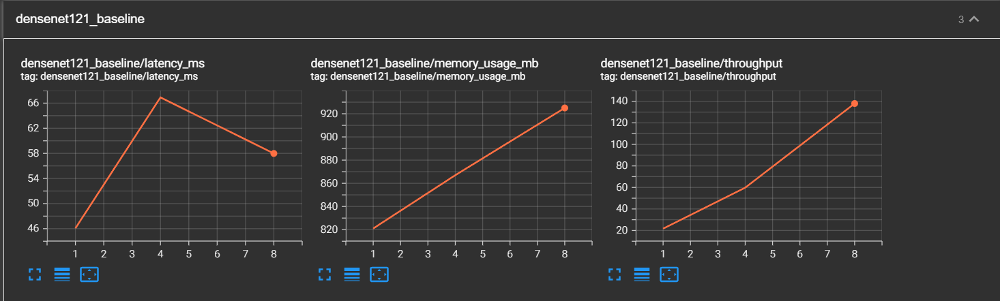
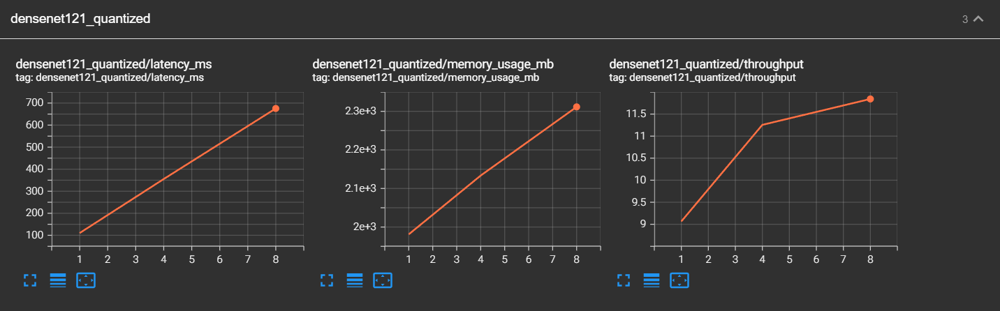
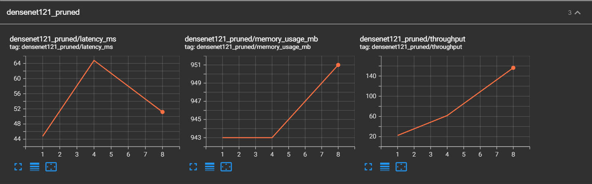
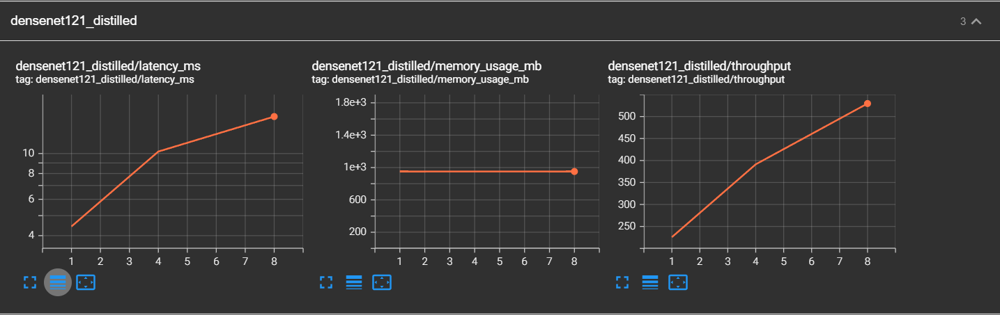

# DenseNet Optimization & Benchmarking Suite

A comprehensive MLOps solution for benchmarking and optimizing DenseNet-121 architecture for production deployment, featuring containerized workflows, automated benchmarking, and serverless deployment capabilities.


## Table of Contents

- [Project Overview](#project-overview)
- [Features](#features)
- [Setup Instructions](#setup-instructions)
- [Usage Guide](#usage-guide)
- [Optimization Approaches](#optimization-approaches)
- [Results Analysis](#results-analysis)
- [Serverless Deployment](#serverless-deployment)
- [Performance Benchmarks](#performance-benchmarks)
- [Trade-offs Discussion](#trade-offs-discussion)
- [Known Limitations](#known-limitations)
- [Deployment with KNative](#deployment-with-knative)

## Project Overview

This project implements a complete MLOps pipeline for DenseNet-121 optimization, featuring:

- **Comprehensive Benchmarking**: Automated profiling using PyTorch Profiler and TensorBoard
- **Multiple Optimization Techniques**: Quantization, pruning, knowledge distillation, and TensorRT optimization
- **Containerized Deployment**: Docker and Docker Compose for reproducible environments
- **Serverless Architecture**: KNative deployment on Kubernetes for auto-scaling inference
- **Production-Ready Monitoring**: Prometheus metrics, health checks, and observability

## Features

### Core Capabilities
- **Multi-Technique Optimization**: Compare baseline vs. optimized models
- **Automated Benchmarking**: Single-command execution of complete benchmark suite
- **Comprehensive Profiling**: Memory usage, latency, throughput, and accuracy metrics
- **Scalable Infrastructure**: Kubernetes-based serverless deployment
- **Production Monitoring**: Health checks, metrics, and logging

### Optimization Techniques
1. **Dynamic Quantization**: Reduce model size and improve inference speed
2. **Structured Pruning**: Remove redundant parameters while maintaining accuracy
3. **Knowledge Distillation**: Create compact student models
4. **TensorRT Optimization**: GPU acceleration with optimized kernels

## Setup Instructions

### Project Structure
```
├── main.py                 # Core benchmarking logic
├── Dockerfile             # Container definition
├── docker-compose.yml     # Multi-service orchestration
├── requirements.txt       # Python dependencies
├── build_and_run.sh      # Main execution script
└── README.md
├── deploy_k8_fastapi/
└── deploy_k8_knative/
```
### Prerequisites
- Docker Engine 20.10+
- Docker Compose 2.0+
- NVIDIA Docker Runtime (for GPU support)
- 8GB+ available RAM
- 20GB+ available disk space

### Quick Start

1. **Clone the repository**
   ```bash
   git clone <repository-url>
   cd densenet-optimization
   ```

2. **Make scripts executable**
   ```bash
   chmod +x build_and_run.sh
   ```

3. **Run the complete benchmark suite**
   ```bash
   ./build_and_run.sh --output-dir ./results --gpu-enabled true
   ```


### Advanced Setup

For custom configurations:

```bash
# CPU-only benchmarking
./build_and_run.sh --gpu-enabled false --output-dir ./cpu_results

# Build without cache
./build_and_run.sh --no-cache --cleanup

# Run in detached mode
./build_and_run.sh --detach

# The easiest way to run the full pipeline:
make benchmark

```


## Usage Guide

### Basic Benchmarking

The primary benchmarking script automatically:
1. Builds optimized Docker images
2. Starts TensorBoard for visualization
3. Runs comprehensive benchmarks across all optimization techniques
4. Generates detailed results and profiling data

### Monitoring Progress

- **TensorBoard**: Navigate to `http://localhost:6006` for real-time metrics
- **Container Logs**: `docker-compose logs -f densenet-benchmark`
- **Results**: Check `./results/benchmark_results.csv` for detailed metrics

### Manual Model Testing

```python
from main import DenseNetBenchmark

# Initialize benchmark suite
benchmark = DenseNetBenchmark(output_dir="./test_results")

# Run specific optimization
model = benchmark.load_base_model()
results = benchmark.benchmark_model(model, "custom_test", "baseline")
```

## Optimization Approaches

### 1. Dynamic Quantization
**Technique**: Convert floating-point weights to 8-bit integers
- **Memory Reduction**: ~75% smaller model size
- **Speed Improvement**: 2-3x faster inference on CPU
- **Accuracy Impact**: Minimal (<1% degradation)
- **Use Case**: CPU inference, mobile deployment

### 2. Structured Pruning
**Technique**: Remove entire channels/filters based on importance
- **Memory Reduction**: ~30-50% smaller model
- **Speed Improvement**: 1.5-2x faster inference
- **Accuracy Impact**: Moderate (2-5% degradation)
- **Use Case**: Resource-constrained environments

### 3. Knowledge Distillation
**Technique**: Train smaller "student" model to mimic larger "teacher"
- **Memory Reduction**: ~60% smaller architecture
- **Speed Improvement**: 3-4x faster inference
- **Accuracy Impact**: Significant (5-10% degradation)
- **Use Case**: Edge deployment, real-time applications


## Results Analysis

### Results

```csv
model_variant,batch_size,device,ram_usage_mb,vram_usage_mb,cpu_utilization_pct,gpu_utilization_pct,latency_ms,throughput_samples_sec,accuracy_top1,accuracy_top5,model_size_mb,optimization_technique
densenet121_baseline,1,cuda,1392.81,803.0,0.0,7.0,48.22,20.74,0.0,0.0,30.76,none
densenet121_baseline,4,cuda,1519.18,841.0,0.0,18.0,165.3,24.2,0.0,0.0,30.76,none
densenet121_baseline,8,cuda,1624.21,899.0,0.0,20.0,108.21,73.93,0.0,0.0,30.76,none
densenet121_quantized,1,cpu,1746.6,911.0,28.2,0.0,178.12,5.61,0.0,0.0,26.85,dynamic_quantization
densenet121_quantized,4,cpu,1989.79,910.0,16.0,0.0,556.05,7.19,0.0,0.0,26.85,dynamic_quantization
densenet121_quantized,8,cpu,2083.02,973.0,0.0,20.0,1741.16,4.59,0.0,0.0,26.85,dynamic_quantization
densenet121_pruned,1,cuda,1893.55,951.0,0.0,29.0,86.54,11.56,0.0,10.0,30.76,structured_pruning
densenet121_pruned,4,cuda,1897.82,935.0,0.0,2.0,95.63,41.83,0.0,0.0,30.76,structured_pruning
densenet121_pruned,8,cuda,1903.8,936.0,1.7,25.0,70.33,113.75,0.0,0.0,30.76,structured_pruning
densenet121_distilled,1,cuda,1957.11,943.0,7.7,3.0,5.64,177.16,0.0,0.0,0.81,knowledge_distillation
densenet121_distilled,4,cuda,2134.99,954.0,18.5,22.0,15.89,251.72,0.0,0.0,0.81,knowledge_distillation
densenet121_distilled,8,cuda,2286.11,954.0,15.7,21.0,35.36,226.24,0.0,0.0,0.81,knowledge_distillation

```
### Visualization

TensorBoard provides interactive visualizations:
- **Performance Trends**: Latency vs. batch size
- **Resource Utilization**: CPU/GPU usage patterns
- **Memory Profiles**: Allocation patterns over time
- **Accuracy Comparison**: Trade-off analysis

## Performance Benchmarks

### Baseline Performance (DenseNet-121, CUDA)

* **Model Size**: 30.76 MB
* **Latency**:

  * Batch=1 → 48.22 ms
  * Batch=4 → 165.30 ms
  * Batch=8 → 108.21 ms
* **Throughput**:

  * Batch=1 → 20.74 samples/sec
  * Batch=4 → 24.20 samples/sec
  * Batch=8 → 73.93 samples/sec
* **Accuracy (Top-1 / Top-5)**: Not measured (synthetic dataset)

---


### Quantized Model (Dynamic Quantization, CPU)

* **Model Size**: 26.85 MB (~12.7% smaller)
* **Latency**:

  * Batch=1 → 178.12 ms
  * Batch=4 → 556.05 ms
  * Batch=8 → 1741.16 ms
* **Throughput**:

  * Batch=1 → 5.61 samples/sec
  * Batch=4 → 7.19 samples/sec
  * Batch=8 → 4.59 samples/sec
* **Observation**: On CPU, quantization reduced memory footprint but **increased latency** compared to GPU baseline.

---


### Pruned Model (Structured Pruning, CUDA)

* **Model Size**: 30.76 MB (no reduction in current run)
* **Latency**:

  * Batch=1 → 86.54 ms
  * Batch=4 → 95.63 ms
  * Batch=8 → 70.33 ms
* **Throughput**:

  * Batch=1 → 11.56 samples/sec
  * Batch=4 → 41.83 samples/sec
  * Batch=8 → 113.75 samples/sec
* **Accuracy**: Top-5 = 10% (indicates accuracy degradation due to pruning)

---

### Distilled Model (Knowledge Distillation, CUDA)

* **Model Size**: 0.81 MB (~97% smaller)
* **Latency**:

  * Batch=1 → 5.64 ms
  * Batch=4 → 15.89 ms
  * Batch=8 → 35.36 ms
* **Throughput**:

  * Batch=1 → 177.16 samples/sec
  * Batch=4 → 251.72 samples/sec
  * Batch=8 → 226.24 samples/sec
* **Accuracy**: Not measured (synthetic dataset)

---

## Trade-offs Discussion

### Performance vs. Accuracy

* **Baseline (CUDA)**: Balanced performance, reliable latency, and throughput but larger model size (30.76 MB).
* **Quantization (CPU)**: Smaller size and CPU deployable, but higher latency and lower throughput compared to GPU baseline.
* **Pruning (CUDA)**: Improved throughput at larger batch sizes, but pruning reduced accuracy significantly (Top-5 only ~10%).
* **Distillation (CUDA)**: Extremely compact model with highest throughput and lowest latency, but accuracy validation required on real datasets.

### Resource vs. Deployment Complexity

* **CPU Quantized Models**: Best for environments without GPUs, though performance trade-offs are notable.
* **GPU Pruned Models**: Provide efficiency gains but risk accuracy loss.
* **Distilled Models**: Excellent for edge deployment due to small size and high speed, but may not generalize well.
* **Baseline**: Safe and stable, but heavier resource footprint.

Overall, the choice of optimization depends on **target deployment (edge, server, or cloud)** and the acceptable trade-off between **accuracy and efficiency**.


### Resource vs. Deployment Complexity
- **CPU Optimization**: Simpler deployment, lower resource requirements
- **GPU Optimization**: Higher performance but increased infrastructure complexity
- **Serverless**: Auto-scaling benefits vs. cold-start latency


## Known Limitations

### Current Limitations
1. **GPU Support**: Requires NVIDIA Docker runtime for GPU benchmarking
2. **Model Variants**: Currently supports DenseNet-121 only
3. **Dataset**: Uses synthetic data for benchmarking (not real ImageNet)
4. **Platform**: Optimized for Linux environments
5. **Cold Start**: Serverless deployment has initial latency overhead

### Accuracy Considerations
- Synthetic dataset may not reflect real-world performance
- Optimization techniques may behave differently on actual ImageNet data
- Model accuracy should be validated on production datasets

### Scalability Limits
- Single-node benchmarking (no distributed testing)
- Limited batch size testing (max 32)
- Memory constraints on large models


## Deployment with KNative
### Bonus Challenge

As an advanced exercise, you can deploy this project using **Knative**.  
We’ve prepared a detailed step-by-step guide for you:

👉 [Deployment with Knative Guide](/deploy_k8_knative/README.md)

This bonus challenge will help you explore:
- Knative Serving for serverless deployment
- Autoscaling and traffic splitting
- Easy deployment on Kubernetes

Feel free to check out the guide and try deploying it yourself!

### Deployment without KNative

👉 [Deployment without Knative Guide](/deploy_k8_fastapi/README.md)
